# QCVE (Quantum Computing Vulnerabilities are Everywhere) CodeQL Runner


This repo is designed to allow CodeQL scripts to be submitted to detect for quantum vulnerabilities in open-source projects. This is a community-sourced project by pQCee.com in collaboration with ayks.io and moonlay.com. For more information or to participate in the program, please contact info@pqcee.com

The URL for the project is: https://github.com/pqcee/QCVE-runner 

## How To

This repo contains workflow that will analyze submitted query against selected database, the workflow will generate sarif report

- Clone this repo
    ```
    git clone https://github.com/pqcee/qcve-runner.git
    ```
- Checkout new branch with folowing format `request/{contributor-name}`
    ```
    git checkout -b request/john
    ```
- Create folder inside folder `queries`, make sure folder name using `contributor name`
- Create file `qlpack.yml` inside contributor folder, copy following script
    ```ql
    name: pqcee/qcve-runner
    version: 0.0.0
    dependencies:
        #this must match your query language
        codeql/javascript-all: "*"
    ```
 
- Create `queries.xml` file inside contributor folder, copy following script
    ```ql
    #this must match your query language
    <queries language="javascript"/>
    ```
- Add new CodeQL query (with .ql extenstion) inside contributor folder

    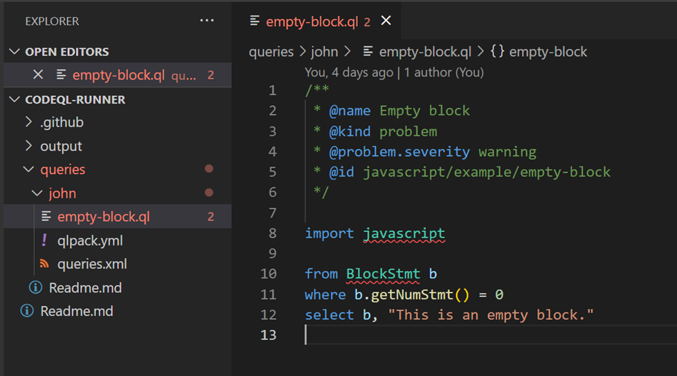

- Commit and push changes
    ```
    git add .
    git commit -m “commit message”
    git push -u origin request/john
    ```
- Go to [Pull Request](https://github.com/pqcee/qcve-runner/pulls) Page, and Create Pull Request from your `request/{contributor-name}` branch to `main` branch

    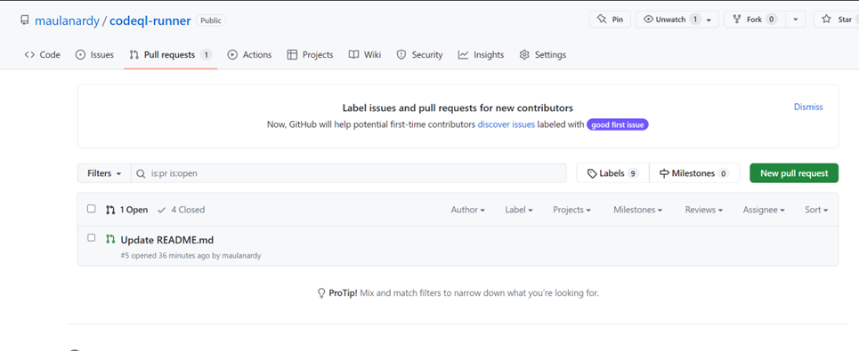
    
- Select branch to compare and create pull request, this must same with branch you create before.
    
    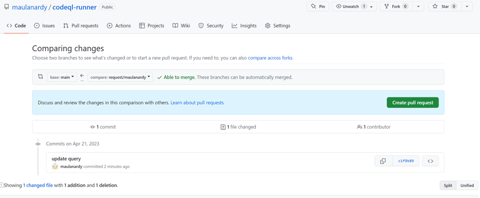

- Add configuration tag inside PR description
    - `#database`: selected database for analyze
    - `#username`: name of contributor _(this must equivalent with query folder you created before)_
    _example_
    ```
    Add new query to analyze #database=openssl submitted by #username=maulanardy
    ``` 
    
    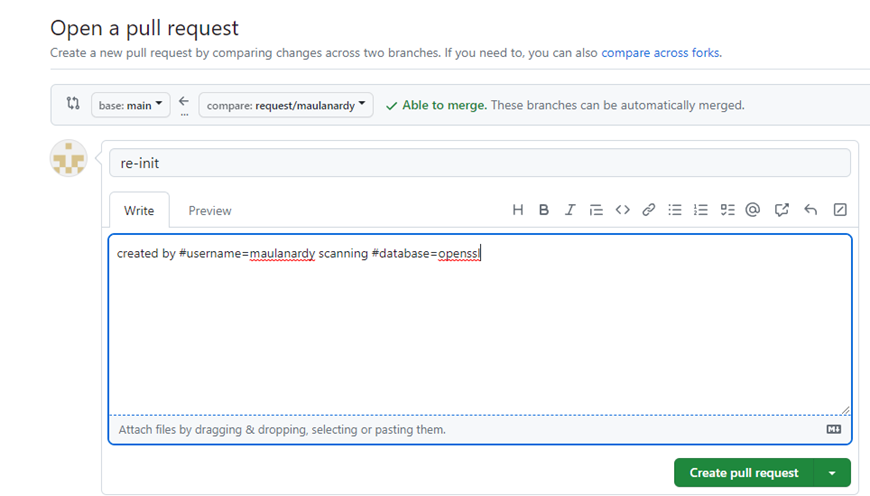

- The Pull Request will trigger action to run, You can see the detail in Github Action Tab
    
    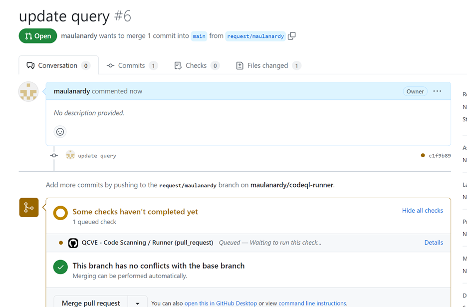

- Green check icon marks the process is succeeded.
    
    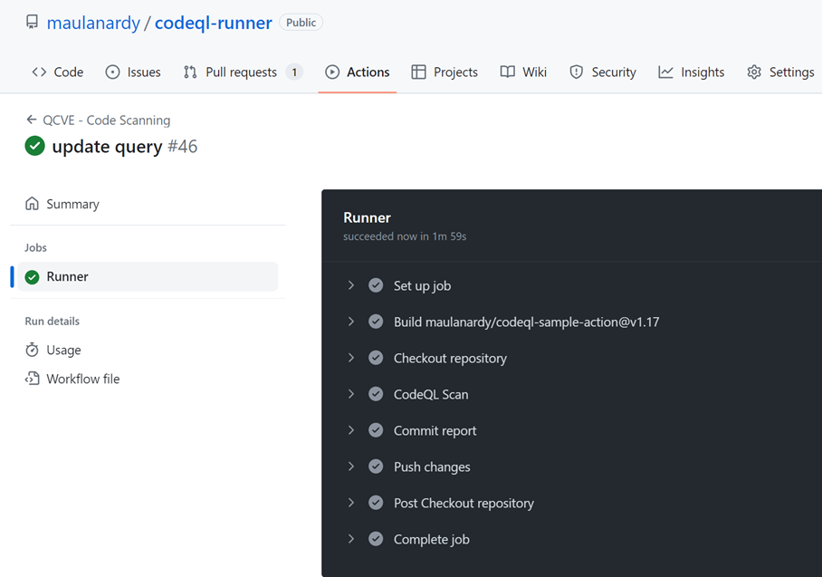

- Back to Pull Request page, select Tab Commits, you will see new Commit by `github-actions[bot]` containing new sarif report inside `output/{contributor}/result.sarif` folder 
    
    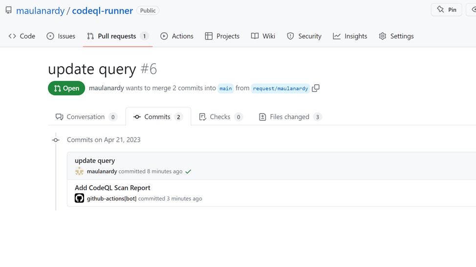

- Pull your branch to local environment
    
    ```
    git pull
    ```

- You will see sarif generated report inside /output/{username} directory
    
    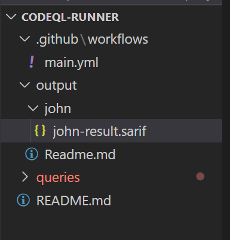

- Install sarif viewer extension in vscode to view the report
    
    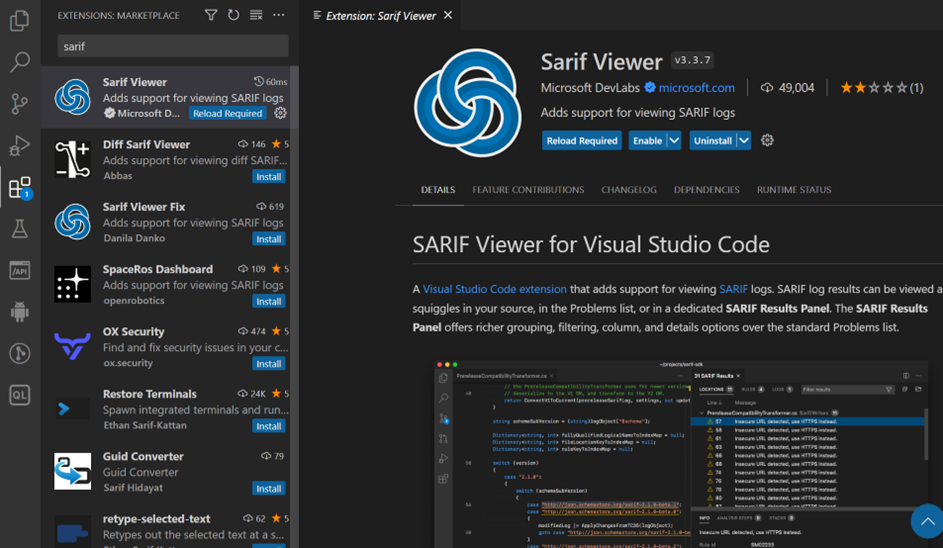
    
    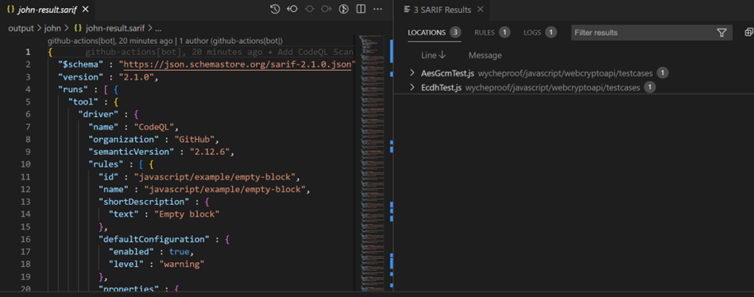

- Back to Github Repository, Merge Pull Request to branch ‘main’ if submitted query approved
    
    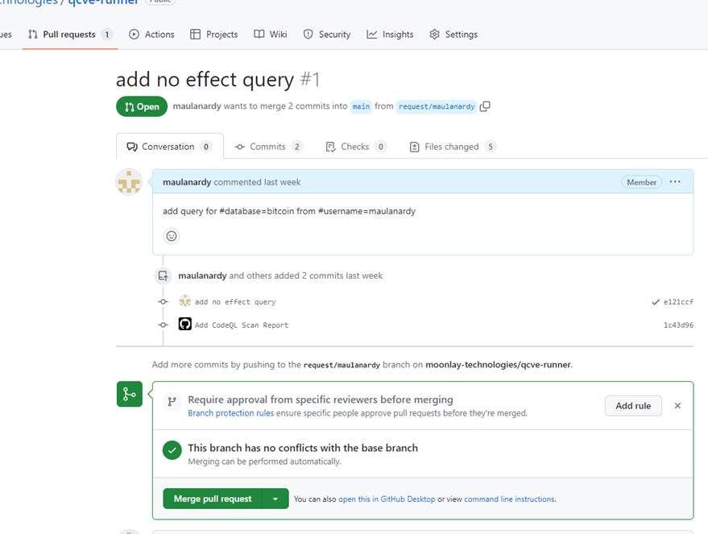

for more details, please contact info@pqcee.com
